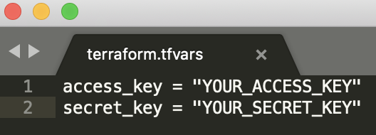

# Launch JupyterHub to AWS with Terraform

This code makes it easy to launch [The Littlest JupyterHub](https://the-littlest-jupyterhub.readthedocs.io/en/latest/) to AWS using [Terraform](https://terraform.io) rather than doing the point-and-click installation. Terraform is an infrastructure as code software that lets you define and  provision infrastructure in the public cloud.

# Prerequisites

This guide assumes you have:

- Already downloaded Terraform. If not, you can download it [here](https://www.terraform.io/downloads.html).
- Have an Amazon Web Services account. If not, you can create an account [here](https://aws.amazon.com/).
- Have an AWS access key and secret key. If not, you can create your keys [here](https://docs.aws.amazon.com/general/latest/gr/managing-aws-access-keys.html).  

## Steps

1. Download this repository.

2. In the folder, create a file called `terraform.tfvars`. That file should contain your AWS access and secret keys. Below is an example.  

   

3. In the file `aws-creds.tf`, you can change your AWS region, AMI, and instance size. The defaults are East-1, an Ubuntu Server 18.04 LTS (HVM), and t3.medium. You can learn more about instance sizes [here](https://aws.amazon.com/ec2/pricing/on-demand/). You probably will not change the region or AMI.

4. In your command line, navigate to the cloned repository on your computer (e.g., on a Mac in Terminal type `cd ~/Desktop/tf-jupyterhub-aws`).

5. The first time you run Terraform, type `terraform init`.

6. Then type `terraform apply`. You can review the plan of what Terraform will create. Then you can enter `yes`.

7. Terraform will then launch the AWS instance and print the public DNS so you can access the instance.

8. The Littlest JupyterHub is now installing in the background on your new server. It takes around 10 minutes for this installation to complete.

9. When the installation is complete, navigate to the public DNS and you should see a JupyterHub login page.

10. The first time you log in, you should log in using the username `admin` and a password you set. Use a strong password and write it down somewhere, since this will be the password for the admin user account.

11. You can check on the status of your instance at https://console.aws.amazon.com/ec2.

12. If you ever wish to stop the instance, just enter `terraform destroy` in your command line. This will delete the instance and all files associated with it.  